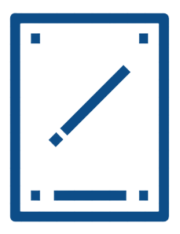
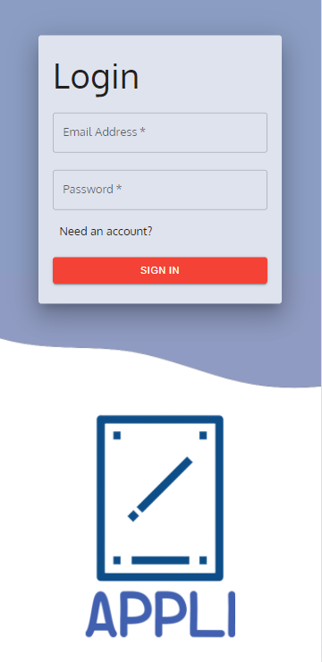
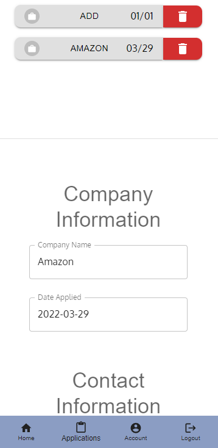
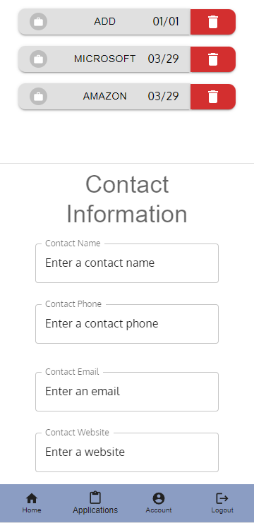
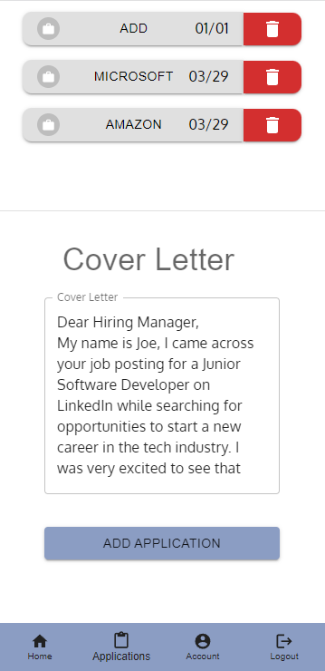
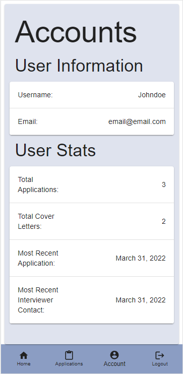

# Appli


## License
  [](https://opensource.org/licenses/MIT)
  [](https://docs.npmjs.com/policies/npm-license)

## Table of Contents
[Description](#description)

[Technology](#technology)

[Usage](#usage)

[Screenshots](#screenshots)

[Future Development](#future)

[Contributors](#contributors)

## Description
In the complicated and highly stressful environment of job searching, we want to help users track their application status. 

    Appli's will help users track the following: 
        - Company's applied to 
        - Application's Date
        - Response Received?
        - Contact at the company and their contact methods
        - Track your personalized cover letters

This is all done for you so you can be more organized, in the loop and prepare for your interview that we all stress about. 


## Technology
Appli's goals were achieved using the following technologies: 
- [Material UI](https://mui.com/)
- [React](https://reactjs.org/)
    - [React Router Dom](https://v5.reactrouter.com/web/guides/quick-start)
    - [React Dom](https://reactjs.org/docs/react-dom.html)
- [Apollo/GraphQL](https://www.apollographql.com/)
- [JWT](https://jwt.io/)
- [date-fns](https://date-fns.org/)
- [ES-Lint](https://eslint.org/)
- [NPM Libraries](https://www.npmjs.com/)
    - [React Scripts](https://www.npmjs.com/package/react-scripts)
    - [Nodemon](https://www.npmjs.com/package/nodemon)
    - [Concurrently](https://www.npmjs.com/package/concurrently)
    - [bcrypt](https://www.npmjs.com/package/bcrypt)

- Honorable Mention: [Zoom](https://zoom.us/)

## Usage
This application is currently deployed on Heroku! 

Check us out [HERE](https://appli-official.herokuapp.com/)
```
User Manual: 
    1. You will be required to create an account. 
    2. Log-in once you have signed up. 
    3. Go to applications page and start adding your details 
    4. You may DELETE an application if you're no longer interested. 
    5. You may EDIT an application if you've received updates. 
    6. Once you get a response back, you can view your details of 
       application to better prepare for your interview! 
```
What are you doing? START APPLYING!

## Test
No testing was done for this project. 

However, please feel free to contribute to this project or contact our devs to join our team! 

## Screenshots






## Future Development 
- Word Tune Implementation

    Implement Word Tune API which will help our users refine their cover letter and be suggested a better way to word their experiences to present to companies.  

    [WordTune](https://www.wordtune.com/?utm_campaign=BrandSearch&ad_set_name=Wordtune&utm_source=google-search&utm_medium=cpc&utm_campaign=BrandSearch&ad_set_name=Wordtune&utm_term=%2Bword%20%2Btune&gclid=CjwKCAjwi6WSBhA-EiwA6Niokxg4IQ4YQamrOI-UdYhl0SjTazhi6SkV7H3oj4rBirBVMrQwj4mYKBoCUFsQAvD_BwE)
- PDF Viewer
    
    Implement a PDF Viewer which will help our users by being able to upload PDF files of the cover letters instead of having to copy paste the text contents. This would enhance our user experience

    [React PDF](https://www.npmjs.com/package/react-pdf)
- AWS S3

    Implement AWS S3 so we can store and manage large quantities of user data and PDF's that our users will be uploading to our DB securely and efficiently. 

    [AWS S3](https://aws.amazon.com/s3/)

## Contributors
```
    Got any questions or want to contribute to this project?
                                                    (or hire us...?) 
```
Contact our fantastic devs via github or email!

Front End
  - [Travis Anderson](https://github.com/Travis-Anderson023)

Back End
  - [Sevag Gaprielian](https://github.com/sevaggap)
  - [Joe Lee](https//:github.com/Jollypong) 

## 
